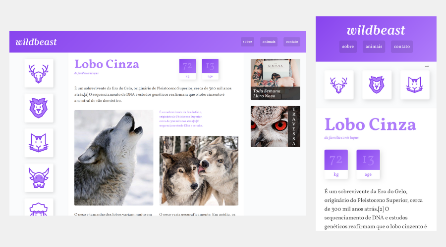

# Wildbeadt

This is the final project of the course CSS Grid Layout [Origamid](https://www.origamid.com/curso/css-grid-layout/). Origamid is a platform for UI/UX Design and Front End Development courses.

## Table of contents

- [Overview](#overview)
  - [The challenge](#the-challenge)
  - [Screenshot](#screenshot)
  - [Links](#links)
- [My process](#my-process)
  - [Built with](#built-with)
  - [Continued development](#continued-development)
- [Author](#author)
  - [Social media](#social-media)

## Overview

### Screenshot

### Links

- Site URL: [https://wildbeastgrid.netlify.app/](https://wildbeastgrid.netlify.app/)

## My process

### Built with

- Semantic HTML5 markup
- CSS custom properties
- Responsive Web Design
- CSS Grid Layout

### Continued development

I now intend to do projects to practice CSS Grid Layout in order to evolve to the next level.

## Author

### Social media

- Frontend Mentor - [ezequielsan](https://www.frontendmentor.io/profile/ezequielsan)
- Instagram - [ezequielmelo.dev](https://www.instagram.com/ezequielmelo.dev/)
- GitHub Profile - [ezequielsan](https://github.com/ezequielsan)
